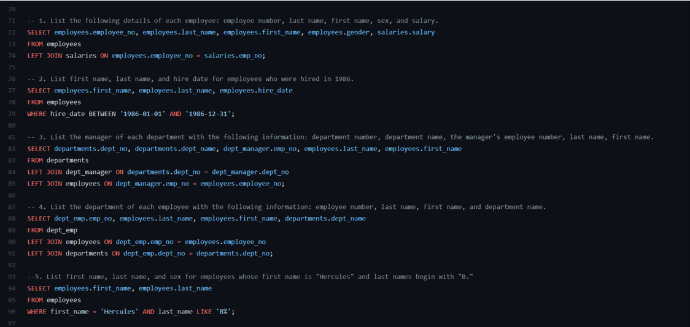

# SQL - Employee Database

## Data Engineering

Created a Entity Relationship Diagram to plan out framework to combine 6 CSV files with employee information.Exported ERD to pgAdmin. Using PgAdmin, I was able to use this framework and create table schemas for a employee database. In doing this I have created primary and foreign keys to align data.

## Data Analysis

Using PgAdmin with clean tables I am now able to dive into database via sql. Pictured below is specific data I am looking for and what commands I used to get to that data.

For example question 4 results are pictured below:

Contact 
mattweiper@gmail.com
